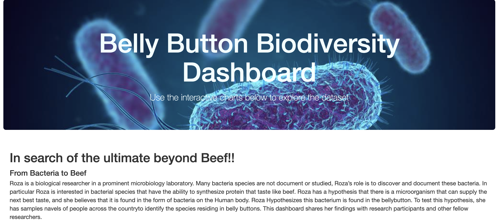
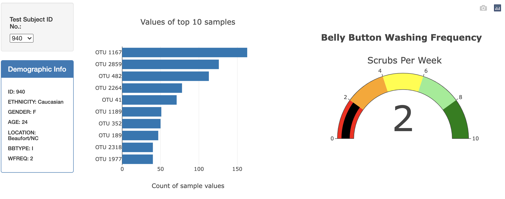
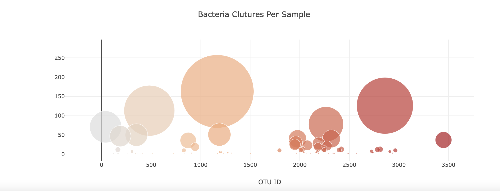
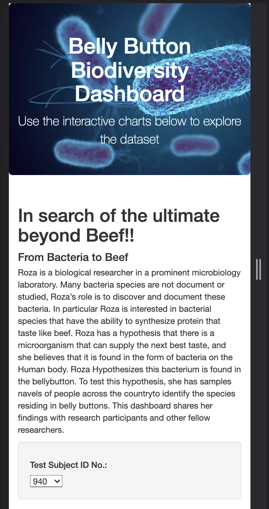
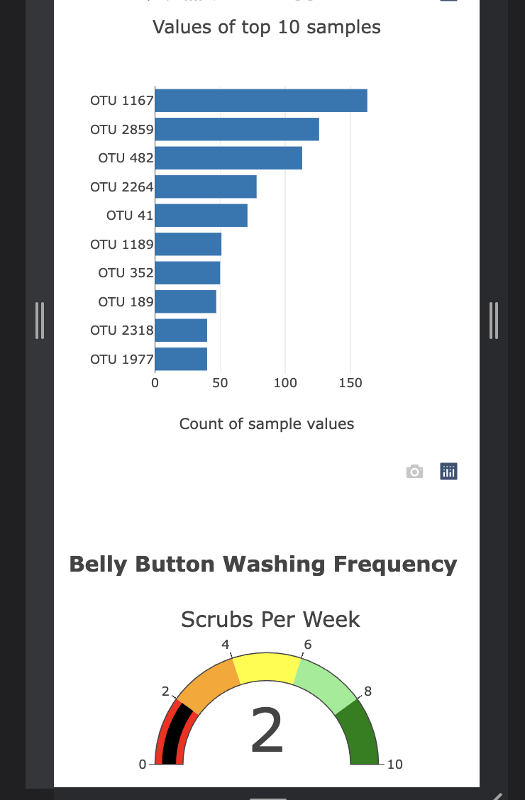

# Overview
In this project we help Roza a biological researcher in a prominent microbiology laboratory. Many bacteria species are not document or studied, Roza’s role is to discover and document these bacteria. In particular Roza is interested in bacterial species that have the ability to synthesize protein that taste like beef. Roza has a hypothesis that there is a microorganism that can supply the next best taste, and she believes that it is found in the form of bacteria on the Human body. Roza Hypothesizes this bacterium is found in the bellybutton. To test this hypothesis, she has samples navels of people across the countryto identify the species residing in belly buttons. This dashboard shares her findings with research participants and other fellow researchers. 

## Resources
- [Data Source](static/js/samples.json)
- Development stack: HTML/CSS, JavaScript, Bootstrap.
- Tools required: Visual Code (recommended)

# Results

Results of the project are described with the help of a running website and screenshots depicting the usage of the website.

## Link to the website 
https://skhidrapure.github.io/Plotly-Challenge/

## Landing Page
Below is the screenshot of the landing page. The website is divided into 4 horizontal sections.

1. A jumbotron Title
2. Introduction paragraph 
3. Data Visualization section 
    1. Sample selection dropdown & Demographic info about the selected sample.
    2. Bar chart to display the top 10 bacterial species (OTUs) when an individual’s ID is selected.
    3. Gauge chart that displays the weekly washing frequency's value.
4. Bubble chart that will display the following when an individual’s ID
    1. The otu_ids as the x-axis values.
    2. The sample_values as the y-axis values.
    3. The sample_values as the marker size.
    4. The otu_ids as the marker colors.
    5. The otu_labels as the hover-text values

### Title and Introduction section

### Bar chart

### Bubble chart

### Mobile view

